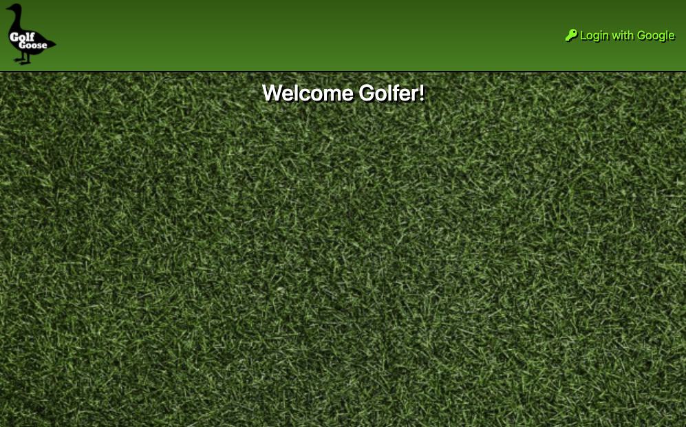
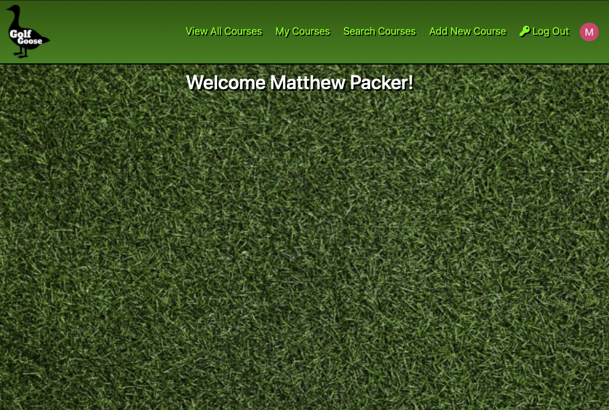
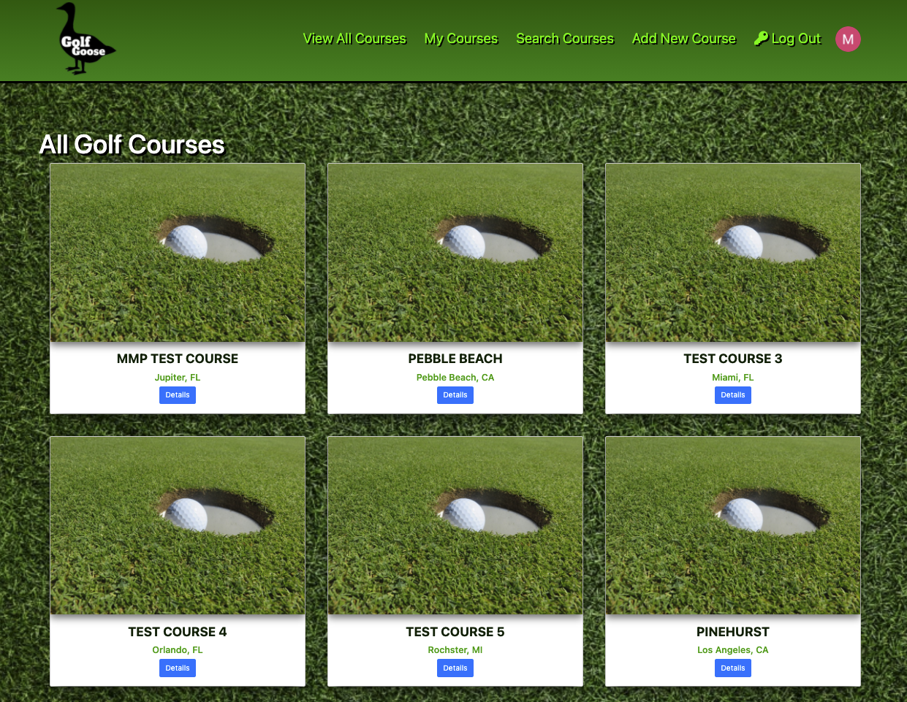
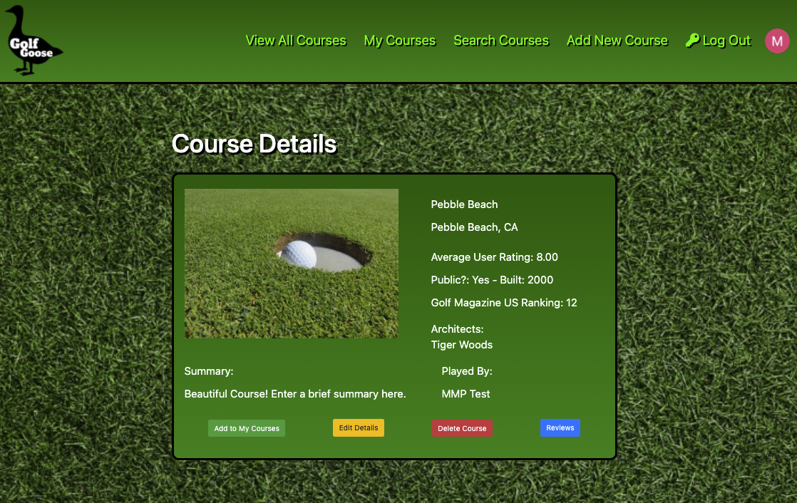
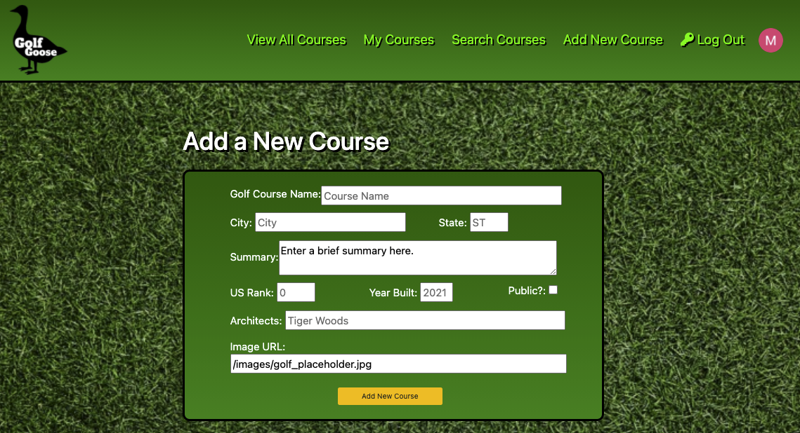

# Golf Goose - by Matt Packer

*Golf Goose* is a full 'MEN' (MongoDB, Express, Node) stack application that makes full use of CRUD (Create, Read, Update, Delete) data operations.

This application is designed to help golf enthusiasts access a database of golf courses developed and maintained by users. Users can login to the app using their Google account (using Google OAuth) and then view a list of courses in the Golf Goose database, add new golf courses to the database, edit and delete course details for golf courses they created, add golf courses to a user-specific list of courses they have played, add reviews to courses they have played, and view reviews left by other users.

*Golf Goose* was created during the second unit of [General Assembly](https://www.generalassemb.ly)'s Software Engineering Immersive program. The initial version was planned, developed and deployed over the course of about one week. It was created from scratch using technologies in the ‘MEN’ stack, including MongoDB, Mongoose, Express, and Node.

Future enhancements are planned. See below for a list of ‘icebox’ features that I plan to implement in the future.

### Getting Started:
The app can be launched [here](https://mp-golf-goose.herokuapp.com/) and was deployed using Heroku.

I used [Trello](https://trello.com/b/T4z0YNwu/mmp-seir-unit-2-project-golf-goose#) to keep myself organized when planning and developing Golf Goose.

### Screenshots:

##### Landing Page

###### Before Login

###### After Login

##### All Golf Courses View

##### Course Details View

##### Add New Course Form View

### Technologies Used:
* MongoDB (Atlas)
* Express
* Node
* Mongoose
* Google Cloud Platform/Google OAuth
* HTML
* CSS
* JavaScript
* Bootstrap
* Git
* GitHub
* Heroku

### Additional Tools and Resources:
* Font Awesome
* Visual Studio Code (VS Code)
* Trello (Planning and Organization Tool)
* Whimsical (Wireframes, Entity Relationship Diagram)
* Canva (Graphic Design Tool)
* PxHere (Free Creative Commons Images)
* Slack (Collaboration and Communication)
* Wikipedia (Golf Course Information and Selected Images)
* Golf.com (Golf Course Rankings and Information)

### Next Steps (Icebox Features):
* Improve the landing page by adding more visual interest to welcome the user to the app.
* Improve app styling, and layouts on most views using CSS and Bootstrap.
* Improve accessibility by optimizing colors, fonts, and layouts.
* Add media queries and fully-responsive layout for an optimized experience on mobile, and large displays.
* Improve responsive rendering of cards on index and mylist views.
* Add more social functionality so that users can interact and add other users as friends.
* Allow users to add and update their user information, such as their bio and avatar.
* Add another data entity to better track designers/architects so that they can be cross referenced between golf courses.
* Add drop down list to the add a new course form that populates a list of architects from a separate data entity.
* Enhance search capabilities to search by other attributes, such as location, architect, and whether a golf course is public or private.
* Add the ability to search directly from the nav bar.
* Add ability to upload images from the app to avoid linking to other sites.
* Enhance footer styling.